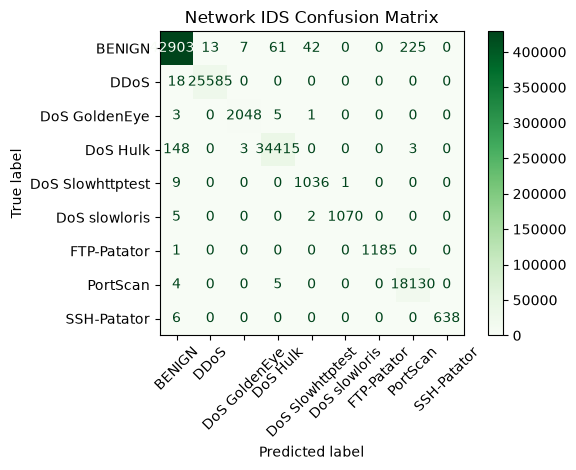
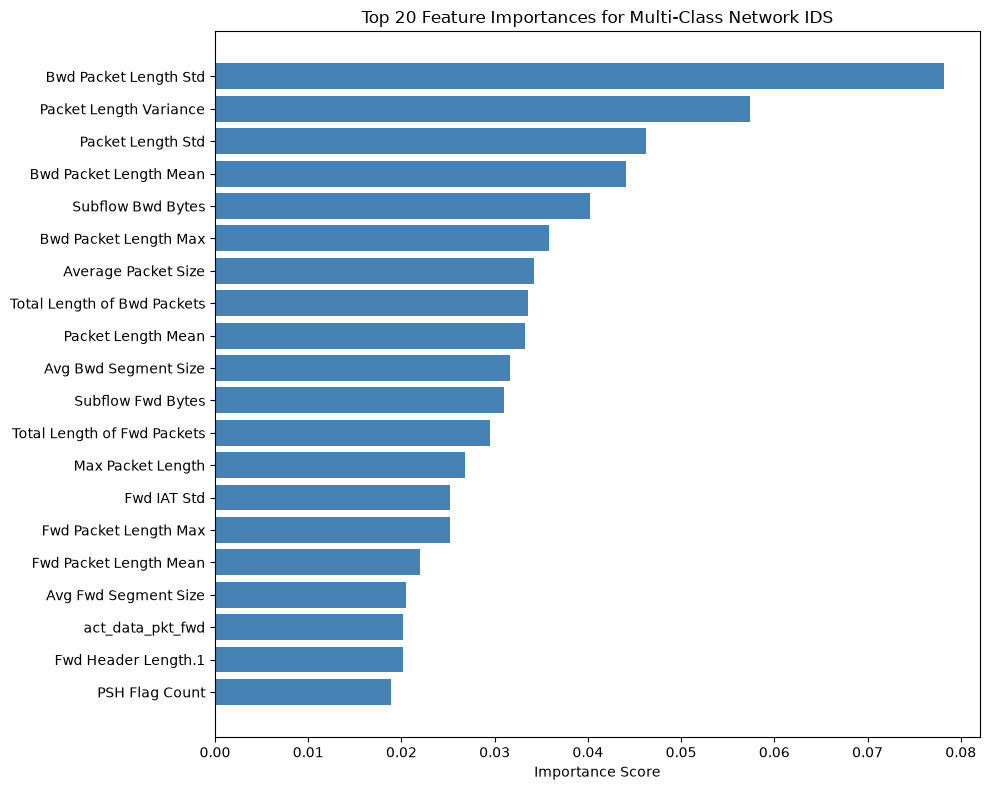

# Network Traffic Anomaly Detection — Multi-Class IDS

A memory-optimized, multi-class Network Intrusion Detection System (IDS) trained on the **CIC-IDS-2017** dataset. The model uses a **Random Forest classifier** to distinguish benign traffic from 8 distinct attack types, achieving **>99% accuracy** across all classes.

## Overview

This project trains a supervised classifier on network flow features (packet lengths, timing, subflow statistics, etc.) to detect and categorize malicious traffic in real time. Rather than a binary benign/malicious split, the model performs **9-class classification**, identifying the specific attack family present in a given flow.

## Detected Classes

| Label | Class          |
|-------|----------------|
| 0     | BENIGN         |
| 1     | DDoS           |
| 2     | DoS GoldenEye  |
| 3     | DoS Hulk       |
| 4     | DoS Slowhttptest |
| 5     | DoS slowloris  |
| 6     | FTP-Patator    |
| 7     | PortScan       |
| 8     | SSH-Patator    |

## Model Details

- **Algorithm:** Random Forest (`sklearn.ensemble.RandomForestClassifier`)
- **Estimators:** 100 trees
- **Max features per split:** `sqrt`
- **Criterion:** Gini impurity
- **Random state:** 42 (for reproducibility)
- **Input features:** 77 network flow features
- **Serialized model size:** ~70 MB (`.pkl`, joblib/pickle format)

The model was tuned for a balance of accuracy and memory footprint, making it suitable for deployment in resource-constrained monitoring environments.

## Dataset

Trained on the [CIC-IDS-2017](https://www.unb.ca/cic/datasets/ids-2017.html) dataset, a widely used benchmark for network intrusion detection containing labeled benign and attack traffic captured over five days, including DoS, DDoS, brute-force, and port scan attacks.

## Performance

### Classification Report

| Class | Precision | Recall | F1-Score | Support |
|-------|-----------|--------|----------|---------|
| BENIGN | 1.00 | 1.00 | 1.00 | 429,380 |
| DDoS | 1.00 | 1.00 | 1.00 | 25,603 |
| DoS GoldenEye | 1.00 | 1.00 | 1.00 | 2,057 |
| DoS Hulk | 1.00 | 1.00 | 1.00 | 34,569 |
| DoS Slowhttptest | 0.96 | 0.99 | 0.97 | 1,046 |
| DoS slowloris | 1.00 | 0.99 | 1.00 | 1,077 |
| FTP-Patator | 1.00 | 1.00 | 1.00 | 1,186 |
| PortScan | 0.99 | 1.00 | 0.99 | 18,139 |
| SSH-Patator | 1.00 | 0.99 | 1.00 | 644 |
| **Accuracy** | | | **1.00** | 513,701 |
| **Macro avg** | 0.99 | 1.00 | 0.99 | 513,701 |
| **Weighted avg** | 1.00 | 1.00 | 1.00 | 513,701 |

- **Overall accuracy:** ~99.9%
- **Multi-Class ROC AUC Score:** 0.9998

### Confusion Matrix



Nearly all predictions land on the diagonal. The small amount of confusion that does occur is concentrated around BENIGN traffic being misclassified as PortScan or vice versa, and minor overlap between similar DoS variants (e.g., DoS Hulk / DoS GoldenEye) — consistent with the underlying similarity of those attack patterns at the flow-feature level.

## Feature Importance



The most predictive features are almost entirely derived from **packet size statistics** rather than timing or flag counts:

1. **Bwd Packet Length Std** — variability in backward (server→client) packet sizes
2. **Packet Length Variance**
3. **Packet Length Std**
4. **Bwd Packet Length Mean**
5. **Subflow Bwd Bytes**

This makes intuitive sense: many attack types (e.g., floods, brute-force tools) generate traffic with highly regular or unusually uniform packet sizes, whereas benign traffic shows more natural variability.

## Usage

```python
import pickle
import pandas as pd

# Load the trained model
with open("network_traffic_anomaly_detection.pkl", "rb") as f:
    model = pickle.load(f)

# X should contain the same 77 features used during training,
# in the same column order
predictions = model.predict(X)
probabilities = model.predict_proba(X)
```

> **Note:** The model expects preprocessed flow-level features matching the CIC-IDS-2017 feature schema (e.g., CICFlowMeter output). Ensure feature engineering/scaling matches the training pipeline before inference.

## Requirements

- Python 3.8+
- scikit-learn
- pandas / numpy

```bash
pip install scikit-learn pandas numpy
```

> The model was serialized with a newer version of scikit-learn than some environments may have installed. If you see an `InconsistentVersionWarning` on load, consider matching your scikit-learn version to the one used for training, or re-serializing the model in your target environment.

## Limitations

- Trained and evaluated on CIC-IDS-2017; performance on live/production traffic or other datasets may differ due to distribution shift.
- Minority classes (e.g., DoS Slowhttptest, SSH-Patator) have far fewer training examples than BENIGN or DDoS, so metrics on those classes are more sensitive to small sample effects.
- As with any supervised IDS, the model can only detect attack patterns represented in its training data and may not generalize to novel or adversarially evasive traffic.

## License

MIT license.
